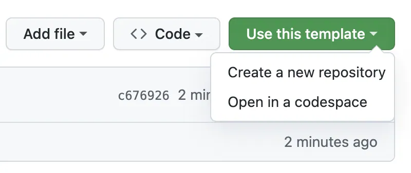

# CVS y GitHub

Se realizar&aacute; una introducci&oacute;n a Git y GitHub, en el cual se explicar&aacute; el uso de estos y se realizar&aacute; una pr&aacute;ctica entregable de forma individual.

## Requisitos previos

- Tener instalado Git en su computadora. Si no lo tiene instalado, puede descargarlo desde [aqu&iacute;](https://git-scm.com/downloads).
- Tener una cuenta en Github. Si no tiene una cuenta, puede crear una desde [aqu&iacute;](https://github.com/join).

## Contenido

- [CVS y GitHub](#cvs-y-github)
  - [Introducci&oacute;n a Git](#introduccion-a-git)
  - [Introducci&oacute;n a GitHub](#introduccion-a-github)
  - [Entrega](#entrega)

Se sugiere seguir el contenido en el orden presentado, tambi&eacute;n es importante revisar los recursos adicionales que est&aacute;n disponibles en [Aulas](https://aulas.ort.edu.uy/course/view.php?id=4095&section=15#tabs-tree-start).

### Introduccion a Git

#### Que es Git?

Git es un sistema de control de versiones distribuido, que permite llevar un control de los cambios realizados en un proyecto. Git es ampliamente utilizado en la industria del desarrollo de software, ya que permite trabajar en equipo de forma eficiente y segura.
Destaca por su rapidez, eficiencia y soporte para proyectos de cualquier tama&ntilde;o. Se puede utilizar tanto en proyectos locales como en proyectos distribuidos (remotos).

A continuaci&oacute;n, se presentan comandos b&aacute;sicos de Git que se utilizaran en el taller.

**Se sugiere revisar la [documentaci&oacute;n oficial de Git](https://git-scm.com/docs) para obtener m&aacute;s informaci&oacute;n sobre los comandos y su uso.**

#### Comandos b&aacute;sicos de Git

- `git init`: Inicializa un repositorio de Git en el directorio actual.
- `git add .`: Agrega todos los archivos al &aacute;rea de preparaci&oacute;n.
  - `git add <archivo>`: Agrega un archivo al &aacute;rea de preparaci&oacute;n.
- `git commit -m "<mensaje>"`: Crea un commit con los archivos en el &aacute;rea de preparaci&oacute;n.
- `git status`: Muestra el estado actual del repositorio.
- `git log`: Muestra el historial de commits.
- `git diff`: Muestra los cambios realizados en los archivos.
- `git stash`: Guarda los cambios en un [stash](https://git-scm.com/docs/git-stash).

#### Comandos de Git para trabajar con ramas

- `git branch`: Muestra las ramas del repositorio.
  - `git branch <nombre>`: Crea una nueva rama.
- `git switch <rama>`: Cambia a la rama especificada.
- `git checkout <rama>`: Cambia a la rama especificada.
  - `git checkout -b <rama>`: Crea una nueva rama y cambia a ella.
- `git merge <rama>`: Fusiona la rama especificada con la rama actual.

#### Comandos de Git para trabajar con repositorios remotos

- `git clone <url>`: Clona un repositorio remoto en el directorio actual.
- `git remote add origin <url>`: Agrega un repositorio remoto al repositorio local.
- `git push`: Sube los cambios al repositorio remoto.
  - `git push origin <rama>`: Sube los cambios de la rama al repositorio remoto.
- `git pull`: Descarga los cambios del repositorio remoto.
  - `git pull origin <rama>`: Descarga los cambios de la rama del repositorio remoto.

#### Estados de los archivos en Git

Los archivos en Git pueden estar en tres estados diferentes:

- **Modificado**: El archivo ha sido modificado, pero no ha sido agregado al &aacute;rea de preparaci&oacute;n (**_modified_**).
- **Preparado**: El archivo ha sido agregado al &aacute;rea de preparaci&oacute;n (**_staged_**).
- **Confirmado**: El archivo ha sido confirmado en el repositorio (**_committed_**).

### Introduccion a Github

#### Que es Github?

GitHub es una plataforma de desarrollo colaborativo que permite alojar proyectos utilizando el sistema de control de versiones Git. Nos permite crear **repositorios**, **colaborar en proyectos**, realizar **seguimiento de problemas** y mucho m&aacute;s. Genera un entorno de trabajo colaborativo y social, que facilita la interacci&oacute;n entre los miembros de un equipo de desarrollo.

Adem&aacute;s del control de versiones, GitHub nos permite realizar **acciones automatizadas**, **integraci&oacute;n continua**, **despliegue continuo** y **gesti&oacute;n de proyectos**, entre otras funcionalidades.

#### Gu&iacute;as útiles para trabajar con GitHub

- [Crear un repositorio](https://docs.github.com/es/github/getting-started-with-github/create-a-repo)
- [Clonar un repositorio](https://docs.github.com/es/github/creating-cloning-and-archiving-repositories/cloning-a-repository)
- [Forkear un repositorio](https://docs.github.com/es/github/getting-started-with-github/fork-a-repo)
- [Crear una rama](https://docs.github.com/es/github/collaborating-with-issues-and-pull-requests/creating-and-deleting-branches-within-your-repository)
- Que es un [pull request](https://docs.github.com/es/github/collaborating-with-issues-and-pull-requests/about-pull-requests)?
  - [Crear un pull request](https://docs.github.com/es/github/collaborating-with-issues-and-pull-requests/creating-a-pull-request)
  - [Revisar un pull request](https://docs.github.com/es/github/collaborating-with-issues-and-pull-requests/reviewing-changes-in-pull-requests)
  - [Fusionar un pull request](https://docs.github.com/es/github/collaborating-with-issues-and-pull-requests/merging-a-pull-request)
- Que es un [issue](https://docs.github.com/es/github/managing-your-work-on-github/about-issues)?
  - [Crear un issue](https://docs.github.com/es/github/managing-your-work-on-github/creating-an-issue)
  - [Asignar un issue](https://docs.github.com/es/github/managing-your-work-on-github/assigning-issues-and-pull-requests-to-other-github-users)
- [Cambiar la visibilidad de un repositorio](https://docs.github.com/es/github/administering-a-repository/managing-repository-settings/changing-the-visibility-of-your-repository) (p&uacute;blico o privado)
- [Eliminar un repositorio](https://docs.github.com/es/github/administering-a-repository/managing-repository-settings/deleting-a-repository) (Se eliminan todos los datos)
  - [Archivar un repositorio](https://docs.github.com/es/github/creating-cloning-and-archiving-repositories/archiving-a-github-repository) (Se mantiene la informaci&oacute;n del repositorio, pero deja de ser visible)

Para m&aacute;s informaci&oacute;n, se sugiere revisar la [documentaci&oacute;n oficial de GitHub](https://docs.github.com/es)

### Entrega

[archivo](./entrega/ejercicio.md) `entrega/ejercicio.md`, en este archivo se encuentra la consigna del ejercicio a realizar.

Para realizar la entrega, se debe seguir los siguientes pasos:

1. Duplicar el repositorio en su cuenta de Github usando el template provisto. Para ello, se debe hacer click en el bot&oacute;n `Use this template` en la parte superior de la p&aacute;gina. [ver guia](https://docs.github.com/en/repositories/creating-and-managing-repositories/creating-a-repository-from-a-template)



2. Clonar el repositorio en su computadora.

```bash
git clone https://github.com/<suNombre>/<nombreDelRepo>
cd nombreDelRepo
```

3. Realizar los cambios necesarios acorde a el archivo `entrega/ejercicio.md` para completar la consigna del ejercicio.

4. Agregar los cambios al &aacute;rea de preparaci&oacute;n y realizar un commit.

```bash
git add .
git commit -m "Entrega de Nombre Apellido - NroEstudiante"
```

5. Subir los cambios al repositorio remoto.

```bash
git push
```

6. Copiar la URL del repositorio y enviarla por Teams. _(Asegurarse de que el repositorio sea p&uacute;blico, para que pueda ser accedido por los docentes)._
